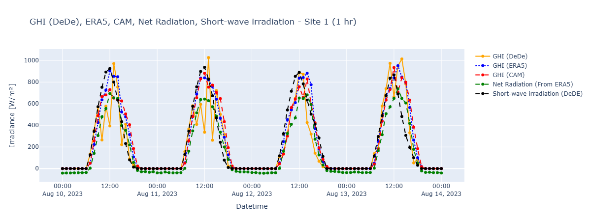
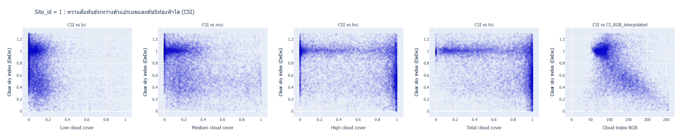

# Solar Radiation Data Processing and Forecasting

## Overview
โครงการนี้นำข้อมูลจากแหล่งต่างๆ เช่น ERA5 และ CAMS มาทำการวิเคราะห์และเปรียบเทียบ เพื่อศึกษาปัจจัยที่ส่งผลต่อค่าความเข้มแสงอาทิตย์ (Global Horizontal Irradiance - I) ทั้งในแง่ของการแสดงผลเชิงเวลา และการวิเคราะห์เชิงสถิติ

โดยมุ่งเน้นไปที่:
- การเปรียบเทียบข้อมูลรังสีจากแต่ละแหล่งในช่วงเวลาเดียวกัน
- การประเมินความแม่นยำของแต่ละแหล่งข้อมูลด้วยตัวชี้วัด เช่น MAE, RMSE, MBE และ Correlation
- การนำเสนอข้อมูลด้วยกราฟเปรียบเทียบเพื่อให้เข้าใจแนวโน้มและความแตกต่าง

## Data Preparing
ข้อมูลดิบที่ได้จาก dataset ต่างๆ จะเก็บอยู่ในโฟลเดอร์  `data` โดยจะมีอยู่หลักๆ 3 ส่วนได้แก่

- **กรมพัฒนาพลังงานทดแทนและอนุรักษ์พลังงาน (DeDe)** :
  - ตัวแปรที่ใช้ : ค่ารังสีและ
  - รูปแบบ: csv
  - ข้อมูลจากปี 2023
  - มี timestamp แบบ UTC+7
  - ความละเอียดของข้อมูล 15 นาที

- **ECMWF Reanalysis v5 (ERA5)** :
  - ตัวแปรที่ใช้ : ssrd (J/m2) 
  - รูปแบบ: NetCDF
  - ข้อมูลจากปี 2023
  - มี timestamp แบบ UTC+0
  - ความละเอียดของข้อมูล 1 ชั่งโมง

- **Copernicus Atmosphere Monitoring Service (CAMS)** :
  
  ประกอบไปด้วย 2 ส่วนก็คือ

   **1. solar radiation time-series**
  - ตัวแปรที่ใช้ : GHI (Wh/m2)
  - รูปแบบ: CSV
  - ข้อมูลจากปี 2023
  - มี timestamp แบบ UTC+0
  - ความละเอียดของข้อมูล 1 ชั่งโมง และ 15 นาที
  
   **2. global atmospheric composition forecasts**
  - ตัวแปรที่ใช้ : ssrd (J/m2)
  - รูปแบบ: grib
  - ข้อมูลจากปี 2023
  - มี timestamp แบบ UTC+0
  - ความละเอียดของข้อมูล 1 ชั่งโมง
  
## Data Processing
ขั้นตอนการประมวลผลข้อมูลแบ่งออกเป็นสองส่วนหลัก คือ การประมวลผลข้อมูลจาก ERA5 และจาก CAMS เพื่อให้พร้อมสำหรับการเปรียบเทียบและวิเคราะห์ร่วมกัน

---

### 🔹 1. ERA5 Processing

- ดึงข้อมูลตามตำแหน่งสถานี (`lat`, `lon`) โดยใช้ `method='nearest'`
- แปลง `UTC` → `Asia/Bangkok`
- คัดเฉพาะข้อมูลของปี 2023
- แปลงเป็นรายชั่วโมง (`1H`) และราย 15 นาที (`15min`) ด้วย `resample()`
- เติมค่าขาดหาย (`NaN`) ด้วย `interpolate(method='linear')`
- บันทึกเป็น `.csv` สำหรับแต่ละสถานี

---

### 🔹 2. CAMS Processing

- แปลงข้อมูลจาก JSON หรือ CSV ให้อยู่ในรูปแบบ DataFrame
- แปลง `UTC` → `Asia/Bangkok`
- กรองเฉพาะปี 2023
- หากจำเป็น: แปลงจากรายชั่วโมง → 15 นาที ด้วย `resample()` และ `interpolate()`
- จัดระเบียบคอลัมน์ เช่น `Datetime`, `GHI`
- บันทึกเป็น `.csv` แยกตาม site เช่นเดียวกับ ERA5

---

### 🔹 3. CAMS (Forecast) Processing

- แปลงข้อมูลจาก JSON หรือ CSV ให้อยู่ในรูปแบบ DataFrame
- แปลง `UTC` → `Asia/Bangkok`
- กรองเฉพาะปี 2023
- หากจำเป็น: แปลงจากรายชั่วโมง → 15 นาที ด้วย `resample()` และ `interpolate()`
- จัดระเบียบคอลัมน์ เช่น `Datetime`, `GHI`
- บันทึกเป็น `.csv` แยกตาม site เช่นเดียวกับ ERA5

---

### Output
- ข้อมูล ERA5 และ CAMS จะถูกจัดเก็บไว้ในรูปแบบที่เหมือนกัน
- พร้อมสำหรับการนำไปเปรียบเทียบเชิงสถิติและการวิเคราะห์กราฟ
## Preprocessed Data
- **ERA5** 
  - clound 
  - radiation
    - era5_time_series_15min
    - era5_time_series_1hr
- **CAMS** 
  - cams_time_series_15min
  - cams_time_series_1hr
  - cams_forecast
    - cams_forecast_15min
    - cams_forecast_1hr
## Merged Processed Data
รวมข้อมูลจากไซต์ต่างๆ เข้าด้วยกันเเล้วตัด column ที่ไม่จำเป็นทิ้ง
- merge ด้วย datetime
- ลบ column ที่ไม่เกี่ยวกับ I (ความเข้มเเสงอาทิตย์) 
- คำนวณ Clear Sky Index (สำหรับ cloud)

### Output
- ERA5(ssrd) CAMS(GHI) DeDe(I,Short-wave irradiation) เเบบ 15 min เเละ 1 hr
- CAMS_Forecast(I) DeDe(I) เเบบ 15 min เเละ 1 hr
- ERA5(cloud) DeDe(cloud) Clear Sky Index เเบบ 1 hr
## Visualization and Analysis
หลังจากรวมข้อมูลและคำนวณตัวชี้วัดเสร็จเรียบร้อย ได้มีการสร้างกราฟและวิเคราะห์เปรียบเทียบผลของ CAMS และ ERA5 สำหรับแต่ละสถานี โดยแบ่งออกเป็นหมวดหมู่ดังนี้:

### 1️⃣ Time Series Plot

- เปรียบเทียบค่าความเข้มแสงอาทิตย์ (GHI) ของ CAMS ERA5 DeDe Soda ราย 15 นาที
- วิเคราะห์ค่ารังสีแตกต่างกัน
  

### 2️⃣ Scatter Plot

- ERA5(cloud) & DeDe(CI_RGB) vs DeDe(I)
- ใช้ดูความสัมพันธ์เเละเเน้วโน้มของสองตัวเเปร
  

### 3️⃣ Matrix Score

- เปรียบเทียบค่าทางสถิติของ CAMS เเละ ERA5 โดยใช้ DeDe เป็นค่าจริง
- ค่าทางสถิติมี MAE,RMSE,MBE,nMAE,nRMSE,nMBE,correlation

## Conclusion

## Notebooks

1. **`cams_download.ipynb`**
   
   - download radiation data from **CAMS** using API

2. **`cams_proceed_data.ipynb`**

3. **`era5_proceed_data.ipynb`**

4. **`cams_forecast_proceed_data.ipynb`**

5. **`merge_data.ipynb`**

6. **`matrix_score.ipynb`**

7. **`solar_radiation_visualization.ipynb`**

8. **`cloud_visualization.ipynb`**

9.  **`forecast_today.ipynb`**

---

## Data Folders

- `data`:  

- `merged_data`: 

## Document

report : [Comparison of Modeled Global Horizontal Irradiance (GHI) and Surface Solar Radiation Downwards (SSRD) with Ground-Based Observations
](https://docs.google.com/document/d/1rNs3p3uPPQMf2_isUCiYHSzBlVQZv1ZRGF89WAkM6js/edit?usp=sharing)